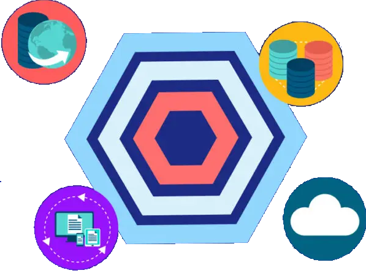
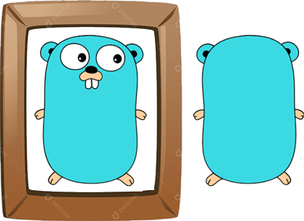
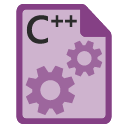
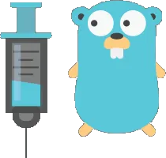
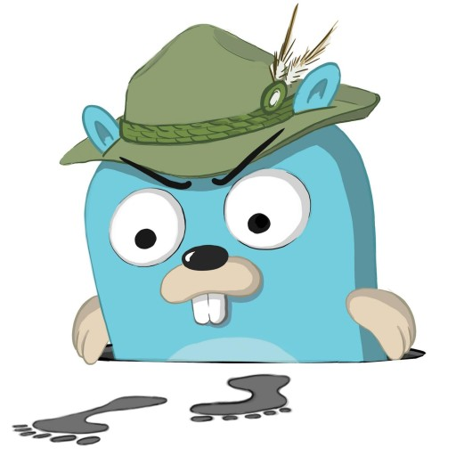
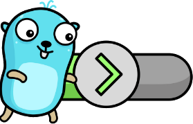

# Sobre o Projeto

Este projeto foi desenvolvido com o objetivo de estudar e aplicar, de forma prática, os conceitos de Arquitetura Limpa/Arquitetura Hexagonal. Além disso, busca demonstrar diretamente no código a implementação e o uso de diversas práticas e ferramentas. A organização dos diretórios não é apresentada como uma abordagem definitiva, mas como uma sugestão que visa facilitar a compreensão e a implementação. A seguir, são detalhadas as práticas e ferramentas utilizadas no projeto.

### ⚙️ Práticas Utilizadas

- {:height="50px" width="70px"} **Arquitetura Hexagonal**  
  - Implementação dos princípios fundamentais da Arquitetura Hexagonal (Ports e Adapters).
     
- {:height="50px" width="70px"} **Reflection**  
  - Utilização do arquivo `util/handler_map.go` para mapear automaticamente funções de manipulação `Handlers`.  
     
- {:height="30px" width="50px"} **Makefile**  
  - Comandos para facilitar a execução de tarefas no projeto.  

### 🛠️ Ferramentas Utilizadas 

- {:height="30px" width="35px"} **Goose** (SQL Migration)
  - Criação e execução de migrações.  
     
- {:height="30px" width="45px"} **Wire** (Injeção de Dependências)
  - Arquivos para configuração de injeção com Google Wire.  

### 🕵️‍♂️ Observabilidade

- {:height="50px" width="30px"} **OpenTelemetry**  
  - Rastreamento de código com exportação via OTLP.  
- {:height="50px" width="30px"} **Jaeger**
  - Integração com o Jaeger para análise de rastreamento.  

### 🧪 Testes

- {:height="50px" width="45px"} **Testes Unitários**: Implementação de testes para validar as funcionalidades.